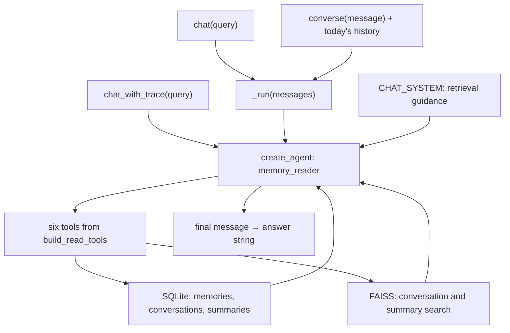

# Repository navigation for planned retrieval

Start with the [required behavior](../../.scratch/memory-v3-retrieval-planning/spec.md), then [report](report.md). Use [evidence](evidence.md) to distinguish source observations from design recommendations. Downloaded revisions are in [sources](sources.md).

## Application map

The reader already loops after tool results. Its missing behavior is an explicit committed decision, one-call scheduling, a hard execution budget, and a same-plan deviation repair path. The two invocation sites must both be covered.

| Local file / location | Purpose for this investigation |
|---|---|
| [agent.py](../../memory_v3_update/agent.py), lines 79–97 | Model/provider factory: OpenAI or Gemini, optionally Vertex |
| Same file, 100–125 | Constructor; local store, ingestion, summarizer and compiled reader ownership |
| Same file, 180–202 and 287–303 | Public chat/trace paths and the two graph invocation sites |
| Same file, 206–234 | Live turn history and per-turn invocation |
| [prompts.py](../../memory_v3_update/prompts.py), 98–134 | Retrieval advice and concise/unknown answer format |
| [tools.py](../../memory_v3_update/tools.py), 39–232 | Authoritative retrieval registry, descriptions, signatures and textual result handling |
| [store.py](../../memory_v3_update/store.py), 128–162, 187–260, 295–354 | SQL limits/order, vocabularies, raw date reads, summaries and semantic index failures |
| [ingest.py](../../memory_v3_update/ingest.py), 135–169 and 348–374 | Raw evidence can survive failed structured extraction; five-turn chunks |
| [summarizer.py](../../memory_v3_update/summarizer.py), 181–221, 269–292 and 541–584 | Dirty checks, missing prerequisites, degraded narrative and domain caching |
| [__init__.py](../../memory_v3_update/__init__.py) | Exports `AgenticMemoryAgent` |
| [README.md](../../memory_v3_update/README.md) | Navigation only: stale package import and `search_preferences` name |
| [test_memory_v3.py](../../tests/test_memory_v3.py), 45–54 and 307–314 | Existing tests target `memory_v3`; live tests substitute a scripted graph |
| [ours_v3.py](../../experiments/methods/ours_v3.py), 11–14 and 28–30 | Existing experiment adapter targets `memory_v3` and consumes tool-call traces |
| [LoCoMo runner](../../benchmarks/locomo/run_v3_agentic.py), 31, 48–53, 99–107 | Existing target and trace-loss-on-exception behavior |
| [v2 runner](../../benchmarks/v2/run_v3.py), 165–175 | Concurrent queries on one shared agent: keep future run counters in invocation state |

## Tool choice map

The model sees the descriptions; the controller should authorize exactly one validated selection. This table is guidance, not a mandatory sequence.

| Tool | Declared arguments | Select when |
|---|---|---|
| `list_entities` | None | The stored category or speaker vocabulary is genuinely unknown |
| `search_memories` | Optional `entity`, `speaker`, `start_date`, `end_date`, `type`; `limit=100` | Exact dates, ordering, facts, events, transitions or counts within the returned coverage |
| `semantic_search_conversations` | `query`, `k=5` | A discussion topic or wording is known, but its date is not |
| `read_conversations_on` | `date`, `days_around=0` | An exact day is known; optional widening is bounded to seven days each side |
| `semantic_search_summaries` | `query`, `k=3` | A broad background, habit or life-event question spans unknown periods |
| `get_summary` | `level`, `identifier=""`, `speaker="user"` | The required summary period and speaker are already known |

## Framework map

Paths below are relative to this investigation directory. Use current v1 LangChain, not `langchain_classic`, to match the application's `create_agent` import.

| Downloaded path | Read to establish |
|---|---|
| `upstream/langchain/libs/langchain_v1/langchain/agents/factory.py` | Reader graph, hooks, tool binding and routing |
| `upstream/langchain/libs/langchain_v1/langchain/agents/middleware/types.py` | `AgentMiddleware`, request wrappers, jump destinations and custom state |
| `upstream/langchain/libs/langchain_v1/langchain/agents/middleware/tool_call_limit.py` | Why a built-in limit alone differs from the requested contract |
| `upstream/langchain/libs/langchain_v1/langchain/agents/middleware/tool_selection.py` | Name selection and filtered tool exposure; no argument commitment |
| `upstream/langchain/libs/langchain_v1/langchain/agents/middleware/todo.py` | To-do planning adds a separate tool; it does not authorize a retrieval action |
| `upstream/langchain/libs/langchain_v1/tests/unit_tests/agents/middleware/implementations/` | Counter-examples and tested limiter/selector behavior |
| `upstream/langgraph/libs/langgraph/langgraph/graph/state.py` | The small graph proposal: typed state, nodes, conditional edges |
| `upstream/langgraph/libs/prebuilt/langgraph/prebuilt/tool_node.py` | Generic tool dispatch is not a committed-plan guard |
| `upstream/langgraph/libs/langgraph/langgraph/pregel/main.py` and `_retry.py` | Graph limits and retry/re-execution caveats |
| `upstream/langchain/libs/core/langchain_core/tools/base.py` | Existing tool argument schemas and invocation validation |
| `upstream/langchain-google/libs/genai/langchain_google_genai/chat_models.py` | Gemini structured-output/raw-response path and named function choice |
| `upstream/langchain/libs/partners/openai/langchain_openai/chat_models/base.py` | OpenAI structured-output/raw-response path and parallel-call setting |
| `upstream/docs/src/oss/langgraph/workflows-agents.mdx` and `graph-api.mdx` | Structured routing patterns and state/edge semantics |
| `upstream/docs/src/oss/langchain/middleware/built-in.mdx` and `custom.mdx` | Existing middleware alternatives and hooks |

For focused navigation, search these symbols rather than reading every package: `create_agent`, `_make_model_to_tools_edge`, `ToolCallLimitMiddleware`, `LLMToolSelectorMiddleware`, `wrap_tool_call`, `add_conditional_edges`, `run_with_retry`, `with_structured_output`, and `first_tool_only`.
