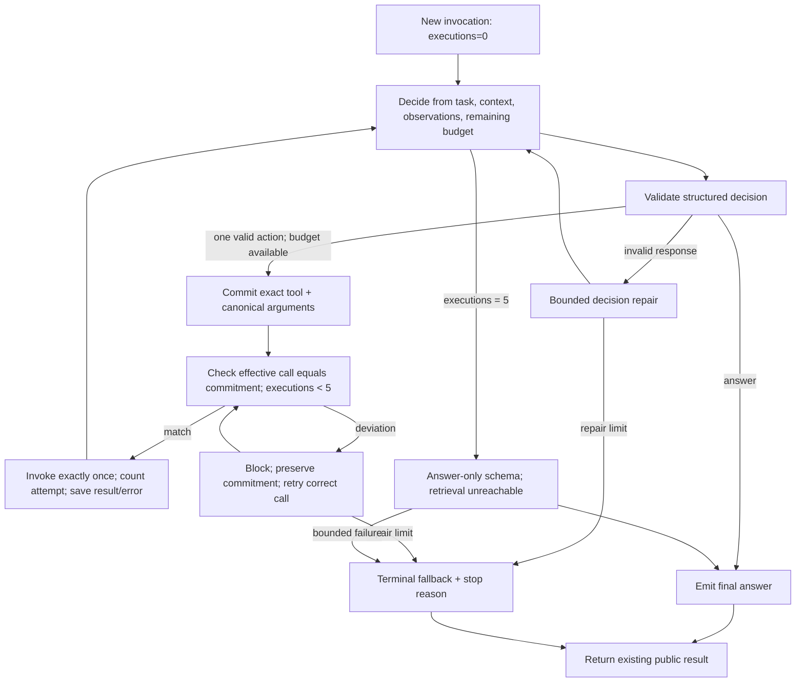

# Planned retrieval in memory_v3_update: implementation investigation

Date: 2026-10-01. Status: investigation and proposal only; application code unchanged.

**Recommended future implementation:** replace this reader's unconstrained `create_agent` loop with a small LangGraph `StateGraph`: a structured next-action decision, a controller that executes exactly that committed action, and an answer-only terminal path. Each invocation gets at most five actual retrieval attempts, with a decision after every result. Keep the public chat interface and six existing tools.

This recommendation follows static inspection of the application, four downloaded official repositories, official documentation, and independent source reviews. It is not a measured performance improvement or a claim that a deployed provider/schema combination has been validated. See [requirements](../../.scratch/memory-v3-retrieval-planning/spec.md), [evidence ledger](evidence.md), [source revisions](sources.md), [navigation map](repo-map.md), and [future acceptance checks](acceptance-checks.md).

## What runs today

`AgenticMemoryAgent` creates the store, fixed ingestion pipeline, summarizer, and a reader built with `langchain.agents.create_agent`. The reader receives all six read tools and `CHAT_SYSTEM`. The local package includes its own store and summarizer modules. Ingestion and summary building are caller-controlled workflows outside retrieval. ([Local construction](../../memory_v3_update/agent.py), lines 100–125; evidence L1.)

The current reader **already has an adaptive tool-result loop** through the framework. The application does not require a separately recorded plan or committed next action, limit responses to one retrieval, enforce a five-call ceiling, or reject a different registered tool. Model-side reasoning may occur, but the code does not make it an auditable execution prerequisite. ([Agent factory](https://github.com/langchain-ai/langchain/blob/ff46bb478bfbef98dd35ea705fa4e92a33881142/libs/langchain_v1/langchain/agents/factory.py), lines 2021–2040; L1–L2, F1.)

`chat()` and `converse()` use `_run()`. `chat_with_trace()` invokes the graph independently. Both sites pass `recursion_limit=60` by default. `converse()` supplies today's user/assistant text on each turn; it does not retain earlier retrieval outputs. A reliable change must cover both invocation sites and reset retrieval state for every turn. ([Entry points](../../memory_v3_update/agent.py), lines 180–202, 224–234, 287–303; L2–L3.)

The prompt gives useful task-based retrieval advice and stopping heuristics. However, the `list_entities` tool separately says to call it first, which can spend a slot unnecessarily when the needed entity, date, summary period, or current-context answer is already known. This is an incentive visible in source, not proof of the observed excess-call cause. ([Prompt](../../memory_v3_update/prompts.py), lines 102–123; [tool description](../../memory_v3_update/tools.py), lines 43–49; L5.)

## Required execution contract

The [specification](../../.scratch/memory-v3-retrieval-planning/spec.md) records the user's requirements separately from operational interpretations. The central invariants for a future implementation are:

1. A validated decision precedes every retrieval execution.
2. Only one committed tool name and canonical argument set can execute at a time.
3. Every actual retrieval invocation spends a slot, including empty results and failures after invocation begins.
4. Blocked proposals do not spend retrieval slots. They have a separate finite repair budget.
5. After every completed or failed attempt, the next decision sees the result/error and remaining budget.
6. Retrieval attempt five is followed by an answer-only decision. A sixth retrieval is unreachable even if the model requests it.
7. A deviation is rejected before dispatch, preserving the committed selection for the correct retry. Replanning follows completed retrieval, not a mismatched proposal.
8. Counters, selections, repair state, and trace events belong to one invocation. The model cannot write trusted counters or dispatch arbitrary state updates.

Five is a ceiling, not a required number of lookups. Questions answerable from the current conversation may use zero tools. Budget exhaustion means the controller has stopped retrieval; it does not prove the store lacks the answer. The answer can use existing evidence or return the existing concise unknown response, with the actual stop reason recorded separately.

## Minimum graph design

Use one reader implementation behind the existing `AgenticMemoryAgent` interface. Reuse the current tool registry and model factory. Keep state and policy at the reader seam so chat, tracing and live turns share the same behavior; do not duplicate the loop at each public method.

The diagram separates policy steps for review; it does not require a node/class for every box. A compact implementation can use three nodes: `decide`, `execute_selected`, and `finish`. Decision validation and repair routing belong inside `decide`; commitment checks belong inside `execute_selected`. After five attempts, `decide` switches to an answer-only schema and can route only to `finish` or bounded repair/fallback. LangGraph supplies explicit state and conditional edges; these invariants remain application responsibilities. ([StateGraph source](https://github.com/langchain-ai/langgraph/blob/157a06dda988d85afeb8751ff27b35ab3f4f8bf4/libs/langgraph/langgraph/graph/state.py); F7.)

### Planning record and state

Planning should be a concise executable decision, not an extra free-form essay or a complete five-step plan that becomes stale after the first result. Supply the task, current conversational evidence, previous retrieval observations, tool descriptions/schemas, and remaining slots. A brief evidence-gap description makes the choice reviewable without exposing private chain of thought.

| Controller-owned state | Purpose |
|---|---|
| Current messages/task and retrieved observations | Inputs to each adaptive decision |
| Proposed action: `answer` or `retrieve` | Routes generation versus retrieval |
| Brief evidence gap and selected tool/arguments | Records what the next lookup is intended to resolve |
| Committed decision ID and canonical call | Authorizes exactly one invocation and associates its result |
| Retrieval attempt count, initially zero | Enforces the fixed ceiling of five |
| Decision/call repair counts and model-call count | Bounds non-retrieval loops independently |
| Final answer and stop reason | Establishes a real terminal result |
| Decision, rejection, invocation and outcome events | Proves what was selected, blocked and executed |

A flat structured envelope is a practical starting point because the existing tool signatures deliberately favor scalar fields. It can carry action, evidence gap, tool name, JSON-encoded arguments, and answer text; parse the argument JSON and validate it against the selected tool's existing schema before commitment. This avoids duplicating six argument schemas into the provider response schema. Typed nested argument variants are also possible if the actual provider/runtime accepts them reliably. Either way, reject unknown fields, unsupported names, invalid dates/types/limits and contradictory action fields locally. The exact envelope is an implementation proposal, not a verified provider schema.

Normalize names, defaults and allowed window/limit values before freezing the selection. Compare effective canonical arguments rather than raw dictionaries, so omitted defaults do not cause false deviations. After commitment, changed names or meaningful argument changes are blocked. Tool descriptions and already-returned metadata can inform planning; the planner must not perform uncounted memory lookups behind the registered tools.

### Execute the planned action directly

The smallest path has the decision model return the complete next action. The controller constructs the exact call from that validated commitment and invokes the registered tool. A second LLM call solely to reproduce the already-chosen tool and arguments provides another failure point and adds latency.

This makes an independent model-emitted retrieval call after commitment unnecessary: there is no competing free tool dispatcher. The pre-invocation guard still verifies registry membership, tool identity, canonical arguments, unused commitment, and budget. If an unexpected proposed call reaches that guard, reject it, record the rejection, and enter a distinct correct-call retry using the preserved commitment. Do not silently execute a corrected version of the rejected proposal and report the rejected proposal as successful.

Invalid planning output is different: before any valid commitment exists, bounded repair can correct the decision itself. Once a choice is committed, repair must not silently switch that choice. After its invocation returns, the next normal decision may select a new tool or answer.

With this design, a normal five-retrieval query needs five next-action model calls and one answer-only model call: six application model invocations, excluding repairs and provider transport retries. A zero-retrieval answer needs one. These are design counts, not measured latency or an assertion that five retrievals are usually needed.

### Literal native tool-emission variant

If the intended interface explicitly requires the model to emit a native tool call after a separately committed planning step, retain a small `emit_selected` phase. Bind only the committed tool, require its name where the provider supports that option, and disable parallel calling where supported. Then inspect the full raw response before execution:

- Require exactly one call, with the committed name and canonical arguments.
- Reject wrong/hidden names, zero/multiple calls, invalid calls, and changed arguments before any tool in the response runs.
- Reply to every rejected call ID if maintaining provider tool-message history.
- Retry **emission of the same committed call**; do not route the mismatch back through a planner that chooses a new tool.
- On bounded retry exhaustion, terminate without invoking an alternative tool.

If implemented and validated, this variant would implement a literal separate emission-and-retry requirement, but ordinarily adds one extra model invocation per retrieval: eleven for five planned retrievals plus final answering, before repairs. Direct planned-action dispatch is preferred for this task's request to avoid bloat. The distinction is explicit so a later implementation does not claim that simply filtering visible tools already implements correct-call retry.

### Counting, retries and termination

Count at the single guarded invocation point, immediately before calling the retrieval tool. Commit the increment and the result/error together in a normal returned node update. Catch expected tool failures inside that executor so a failed attempt still produces an accounted outcome. An empty result, unknown-entity corrective response, invalid-date response, or missing-summary response still costs a slot if the tool actually ran.

Any executor exception or cancellation that prevents this returned state update must terminate retrieval for that invocation. An outer handler may finalize an answer or fallback, but must not rerun the executor or resume retrieval from the pre-attempt count.

For the current stateless invocation pattern, use no automatic retry policy around the retrieval executor and no `ToolRetryMiddleware`. The next decision can deliberately select the same tool again, spending another slot. A framework retry can rerun a failed node before its writes are retained; one model proposal can also produce multiple retry invocations. ([Graph retry source](https://github.com/langchain-ai/langgraph/blob/157a06dda988d85afeb8751ff27b35ab3f4f8bf4/libs/langgraph/langgraph/pregel/_retry.py), lines 600–617; [tool retry source](https://github.com/langchain-ai/langchain/blob/ff46bb478bfbef98dd35ea705fa4e92a33881142/libs/langchain_v1/langchain/agents/middleware/tool_retry.py), lines 322–353; F8, F10.)

Use a separate finite repair policy. For example, two correction attempts after an invalid decision and at most eighteen application model invocations for the direct design would allow up to three attempts for each of its six decision opportunities. Those numbers are proposed defaults; the user specified the retrieval ceiling, not the repair count. Transport retries also need finite provider settings/timeouts because a model-call counter does not count HTTP attempts.

Keep graph recursion as a secondary safeguard sized for planning, execution and repair overhead. Setting `recursion_limit=5` would not implement a five-tool budget. On ordinary exhaustion/failure, finalize from available evidence or use the existing unknown answer format, recording `budget_exhausted`, `repair_exhausted`, or the actual execution failure. Never extract a tool result or an empty tool-calling message as if it were a final answer. Catastrophic process failure cannot promise a returned answer; durable crash recovery is a separate requirement.

Do not add checkpoint/resume behavior for this short loop. If a future requirement demands one five-call budget across crashes, resumes or time travel, it needs a durable trusted attempt ledger and explicit replay/idempotency rules. A plain graph state update and the built-in run limiter do not establish that guarantee.

## Why existing middleware does not complete the request by itself

| Approach | Verified capability | Missing behavior / tradeoff |
|---|---|---|
| Prompt guidance | Encourages source choice and stopping | No deterministic commitment, call cap, or block/repair enforcement |
| `ToolCallLimitMiddleware(run_limit=5)` | Allocates allowed proposals and blocks excess | Counts before invocation, including blocked run proposals; neither plans nor forces a task-answer pass after call five |
| Limiter `exit_behavior="end"` | Stops on an over-limit batch | Returns a canned limit notice and skips that batch, rather than synthesizing the task answer |
| `LLMToolSelectorMiddleware(max_tools=1)` | Adds an LLM selection call and filters visible tool names | Does not commit arguments; its selector input is the last user message, and one exposed name can still be called multiple times |
| `TodoListMiddleware` | Adds a planning list and `write_todos` | Does not authorize the next retrieval and adds an unnecessary tool |
| Custom `create_agent` middleware | Can block proposals and tool dispatch using hooks/wrappers | Requires planning phase state, a whole-response guard, an invocation guard, repair routing, accounting and answer-only mode |
| Small `StateGraph` | Gives these phases explicit state and edges | Application still implements and tests all policy invariants; recommended for clarity/locality |

The built-in limiter uses `after_model` and includes blocked proposals in its run counter; reaching exactly the ceiling does not itself force finalization. Its modes differ from the requested task-answer behavior. ([Limiter implementation](https://github.com/langchain-ai/langchain/blob/ff46bb478bfbef98dd35ea705fa4e92a33881142/libs/langchain_v1/langchain/agents/middleware/tool_call_limit.py), lines 327–471; F3–F4.)

Filtered `request.tools` affects model binding, while ToolNode retains the initially registered dispatch map. A wrong but registered name therefore needs an explicit execution guard. A single-threaded executor merely serializes a batch; it does not insert reassessment between calls. ([Factory](https://github.com/langchain-ai/langchain/blob/ff46bb478bfbef98dd35ea705fa4e92a33881142/libs/langchain_v1/langchain/agents/factory.py), lines 1135–1145, 1427–1487; [ToolNode](https://github.com/langchain-ai/langgraph/blob/157a06dda988d85afeb8751ff27b35ab3f4f8bf4/libs/prebuilt/langgraph/prebuilt/tool_node.py), lines 819–858, 1030–1038, 1268–1279; F1–F2.)

Custom middleware remains viable. An `after_model` guard can supply blocked ToolMessages for every rejected call ID, which makes factory routing exclude them and return to the model; `wrap_tool_call` can also short-circuit invocation. If this path is selected, verify hook ordering and put the final guard where it sees the effective request after any rewriting wrappers. ([Factory routing](https://github.com/langchain-ai/langchain/blob/ff46bb478bfbef98dd35ea705fa4e92a33881142/libs/langchain_v1/langchain/agents/factory.py), lines 1982–2040; [middleware contracts](https://github.com/langchain-ai/langchain/blob/ff46bb478bfbef98dd35ea705fa4e92a33881142/libs/langchain_v1/langchain/agents/middleware/types.py), lines 674–698; F9–F11.)

There is a source/documentation discrepancy: the downloaded guide still describes Python limiter `end` as single-tool-only, while the downloaded implementation and regression tests handle all pending calls in a mixed batch. Use the pinned source and tests for that revision's behavior. ([Pinned guide](https://github.com/langchain-ai/docs/blob/99dd9a9e38d59b9bff54354f6c3ef790c1be946d/src/oss/langchain/middleware/built-in.mdx), line 1470; [regression tests](https://github.com/langchain-ai/langchain/blob/ff46bb478bfbef98dd35ea705fa4e92a33881142/libs/langchain_v1/tests/unit_tests/agents/middleware/implementations/test_tool_call_limit.py), lines 745–786; F4.)

## Reliability gaps beyond routing

These findings affect the chance of answering correctly within five calls. They should not turn the planner change into an unrelated storage rewrite.

| Gap | Effect on planning/answering | Scope recommendation |
|---|---|---|
| Silent earliest-row truncation; no cursor/total | Counts, full timelines and latest-state answers can be incomplete | Record result coverage; qualify answers and prefer narrower date/entity filters. General completeness/pagination is a separate tool-contract improvement. |
| Unconstrained `limit`, `k`, enum-like strings and dates | Invalid/wasteful calls or unexpectedly large results | Validate semantic arguments before commitment; bound positive result sizes. |
| Uncapped joined output, especially widened date reads | Five calls can still exceed context or latency budgets | Bound observations and explicitly mark any truncation; do not truncate invisibly and claim completeness. |
| Name stripping differs from SQL filters | A valid-looking call can return no evidence | Canonicalize before commitment and invocation. |
| Structured-memory empty/range messages omit raw coverage | A planner may stop even though raw conversations exist | Treat those messages as source-specific; do not equate them with global memory absence. |
| FAISS load failure appears as no matches | Backend failure is confused with evidence absence | Preserve/report retrieval status where observable; avoid claiming absence from an unavailable index. |
| Semantic top-k results and five-turn chunks | Partial results can miss a date, speaker, or continuation | Pick exact SQL/date tools when appropriate; do not treat semantic agreement as exhaustive coverage. |
| Missing, stale or degraded summaries | Broad queries can stop on incomplete derived evidence | Allow raw/structured fallback within budget; expose summary validity/freshness as a separate improvement. |
| Repeated identical actions or confirmation searches | Wastes the remaining slots | Include prior actions/outcomes in each decision; require an unresolved evidence gap or a specific retry justification before repeating. |

All concrete storage observations and exact locations are in L7–L14 in [evidence.md](evidence.md). In particular, negative SQL `LIMIT` values remove the row ceiling; do not rely on `min(limit,200)` as semantic validation. ([SQLite SELECT](https://www.sqlite.org/lang_select.html#limitoffset).)

Framework enforcement guarantees call order and budget if implemented correctly. It does not guarantee the LLM selects the best tool, recognizes sufficient evidence, or answers correctly. Those require provider checks and evaluation against tasks representative of the project.

## Integration and future validation

The smallest future change is concentrated in reader construction and shared invocation/result handling, planning/answer instructions, and trace serialization. Keep the existing public method signatures and storage/ingestion workflows. Make `chat_with_trace()` use the same invocation implementation as chat/live turns so it cannot diverge from the guard.

Tracing must distinguish decisions, raw proposals/rejections and actual invocations. `tool_calls`/`num_tool_calls` currently enumerate AI proposals; retaining those names while switching them to actual executions would be a semantic change that must be documented. Alternatively add explicit execution fields while retaining legacy proposal fields. The acceptance checks must assert the trusted execution ledger, not simply the count of AI proposals. Preserve call/decision IDs, canonical arguments, outcome status, used slots and stop reason. Keep internal planning records out of the normal answer text.

Current tests and adapters target `memory_v3`, and live tests use a scripted graph. Before any future behavior claim, the tests must target `memory_v3_update` and exercise its real compiled control flow with controlled model responses and tool spies. Existing benchmark trace loss on exceptions must also be addressed if those runners are used to establish the cap. ([Local tests](../../tests/test_memory_v3.py), lines 45–54, 307–314; [experiment adapter](../../experiments/methods/ours_v3.py), lines 11–14, 28–30; L15–L16.)

The current Google and OpenAI wrappers support structured output with raw/parsed/error information. Their function-calling parsers can select only the first tool, so inspect raw calls rather than assuming parsed output proves singleton compliance. Prefer native JSON planning when supported by the real model/backend. Provider named-choice or parallel-call flags supplement controller validation; they do not replace it. ([Google source](https://github.com/langchain-ai/langchain-google/blob/b476e4b0a0bffbeb5c296bcd9e83aa3f07b68a40/libs/genai/langchain_google_genai/chat_models.py), lines 4376–4564; [OpenAI source](https://github.com/langchain-ai/langchain/blob/ff46bb478bfbef98dd35ea705fa4e92a33881142/libs/partners/openai/langchain_openai/chat_models/base.py), lines 2494–2533, 2773–2803, 2856–2864; P1–P3.)

Remaining implementation-time checks are the actual installed package versions, the exact selected provider/model/backend's schema behavior, defaults/normalization, callback compatibility, all public entry points, and real answer quality/latency under the five-call ceiling. The [acceptance matrix](acceptance-checks.md) describes how to check those behaviors without relying on model goodwill.

No architectural decision has been adopted, and no application code, test code, dependency files, memory stores or prior research artifacts were changed. The final immutability check is recorded in [verification.md](verification.md).
