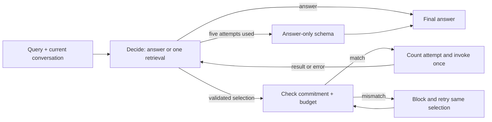

# memory_v3_update

Writing uses the fixed ingestion pipeline and the updated hierarchical summarizer
from `memory_v3/` (commit `9eb992a`). Reading uses a small LangGraph
loop that plans one retrieval, executes that exact selection, and reassesses the
result before choosing another action. This implements the
[recorded retrieval design](../.research/memory-v3-retrieval-planning/report.md).



## Retrieval contract

- `chat()`, `chat_with_trace()`, and each `converse()` turn share the same reader.
  Every invocation has its own commitment, accounting, and repair state.
- The decision contains a short evidence gap, one tool name, and its arguments,
  or a final answer. An answer supported by current context can use zero tools.
- At most **five retrieval invocations** may begin. Empty results, corrective
  responses, and failures spend a slot. Rejected proposals spend no retrieval slot.
- Before dispatch, the controller checks the decision ID, registered tool identity,
  validated canonical arguments, unused commitment, and remaining budget. It rejects
  changed names/arguments and batches before invoking any tool, then retries the
  original commitment in a separate graph iteration.
- The model supplies a complete action; the controller dispatches it directly.
  There is no extra model call just to reproduce an already selected tool. Raw model
  tool calls cannot dispatch retrieval. One matching synthetic schema function is
  accepted as a provider's structured-output transport; additional calls are blocked.
- After attempt five, only the final-answer schema is available. Invalid output gets
  at most two correction attempts per decision or committed call. At most eighteen
  application model invocations are allowed; provider transport retries are separate
  and bounded. The chat model uses a 60-second request timeout and `max_retries=2`.
- Ordinary graph failures, invalid-output exhaustion, and an unexpectedly low graph
  recursion limit return `I don't know.` with a stopping reason. The executor has no
  automatic retry or checkpoint/resume path. A slot and consumed commitment are kept
  in the invocation's trusted ledger even if a node fails before returning its update.

The default graph recursion limit remains 60 as a secondary safeguard. It counts
graph steps and does not determine the five-tool budget. Ingestion and summary
generation have their own existing workflows.

## Tools and evidence bounds

| Tool | Use when |
|---|---|
| `semantic_retrieve_memory` | First memory lookup: relevant weekly, monthly, yearly, lifetime, and optional distilled documents in one call |
| `list_entities` | Stored category or speaker names are unknown |
| `search_memories` | Exact dated facts, events, preferences, ordering, or counts are needed |
| `semantic_search_conversations` | A discussion topic is known, but its date is unknown |
| `read_conversations_on` | A specific day is known |
| `get_summary` | The summary level and period are known |

Arguments are checked before commitment: row limits are 1–200, semantic result counts
are 1–20, date windows are 0–7 days either side, and dates/summary periods must be valid.
Entity and speaker names are stripped and lowercased; defaults enter the canonical
commitment. SQL searches read one additional row to detect and mark truncation.
Each observation is capped at 12,000 characters with an explicit incomplete-evidence
marker. Top-k results, summaries, and empty searches do not establish complete store
coverage; the decision prompt requires suitable evidence or an uncertainty answer.
The combined lookup spends one retrieval slot, regardless of the number of summary
levels returned. It replaces `semantic_search_summaries`; `get_summary` remains for
focused follow-ups. Layer selection reuses the stored FAISS vectors and embeds only
the query once. The controller and its enforcement rules are unchanged.

## Hierarchical summaries

Summaries are generated per speaker in weekly → monthly → yearly → lifetime order.
Weekly facts/events are deduplicated in the summary, while their dated observations
remain in SQLite. Weekly and monthly summaries include narratives; yearly summaries
use readable facts, events, and validated patterns. Extraction records all named
speakers, including emotional associations, and the pattern prompts require repeated
cycles before claiming a habit.

Batch ingestion retains its existing default: call `build_summaries()` afterward, or
pass `update_summaries=True` to `ingest()` for incremental updates. Live `flush()`
updates summaries by default. Incremental generation rebuilds only the affected chain
whose source hashes changed. To rebuild summaries created by the earlier version,
call `build_summaries(force=True)` once.

Distillation maintains four documents per speaker: relationships, identity,
patterns, and timeline. Use `build_summaries(distill=True)` after batch ingestion, or
`distill_knowledge()` for an explicit full-hierarchy refresh. Batch distillation
remains opt-in. With `ingest(update_summaries=True)` or the default live `flush()`,
summary generation is followed by continual distillation for each stored speaker.
Existing documents receive only the affected week and month summaries, together
with their current text, so updates can preserve dated history and transitions.
Initial creation and missing themes use the full hierarchy. Setting
`update_summaries=False` skips both summary and distilled-document updates.

The planner is instructed to start memory retrieval with `semantic_retrieve_memory`,
then answer or select one specific follow-up. It can still answer from current
conversation context with zero tools. Each selected tool is enforced by the existing
controller; the summary-first preference itself is prompt guidance. Summary generation
and distillation are write workflows, outside the five-tool read budget and unavailable
as reader tools.

## Public interface and traces

```python
from memory_v3_update.agent import AgenticMemoryAgent

agent = AgenticMemoryAgent(base_dir="results/synthetic/v3_update/store")
agent.ingest("2026-03-01", [{"time_of_day": "Morning", "turns": [
    {"speaker": "Alice", "text": "Camping helps me relax."}
]}])
agent.build_summaries(distill=True)  # distillation is optional
answer = agent.chat("What is Alice's hobby?")
trace = agent.chat_with_trace("How has Alice's hobby changed?")

agent.converse("I switched to black coffee this morning.")
agent.converse("Remind me what I'm drinking?")
agent.flush("2026-03-01")
```

`chat()` and `converse()` still return answer strings. Live turns retain today's
conversation, and each turn starts with five available slots. `flush()` sends the
buffered conversation through ingestion; summary updates remain enabled by default.

`chat_with_trace()` returns `answer`, `tool_calls`, `num_tool_calls`, `decisions`,
`executions`, `rejections`, `num_model_calls`, and `stop_reason`. **`tool_calls` and
`num_tool_calls` now describe actual invocation attempts**, including failed attempts,
rather than model-emitted proposals. Each execution includes its decision ID,
canonical arguments, status, bounded output, and truncation flag. Rejected proposals
are recorded separately. Normal stops are `answered` or `tool_budget_exhausted`;
repair/graph failures have distinct reasons. Internal decisions are excluded from
the public answer text.

## Implementation and checks

| File | Responsibility |
|---|---|
| [agent.py](agent.py) | Public entry points, shared invocation, model factory, live history |
| [retrieval.py](retrieval.py) | Decision schemas, three-node graph, trusted ledger, dispatch guard, finalization |
| [tools.py](tools.py) | Six read tools, argument validation, coverage markers |
| [prompts.py](prompts.py) | Planning/answer guidance and updated extraction, summary, and distillation prompts |
| [ingest.py](ingest.py), [store.py](store.py), [summarizer.py](summarizer.py) | Multi-speaker write pipeline, SQLite/FAISS storage, hierarchical summaries |
| [distill.py](distill.py) | Themed knowledge documents with full builds and continual updates from affected summaries |
| [tests/](tests/) | Compiled-graph enforcement, generation/retrieval integration, tool validation, mocked providers |

The reader uses LangGraph 1.x, LangChain Core 1.x, and Pydantic 2, with the existing
OpenAI or Gemini integration. Validation used LangGraph 1.2.12, LangChain Core 1.6.6,
`langchain-openai` 1.6.7, and `langchain-google-genai` 4.4.0. Constructing a complete
agent also needs the existing storage/embedding dependencies and provider credentials.

Run from the project root with the framework/storage packages and pytest installed. Keep
temporary artifacts inside the project:

```sh
mkdir -p tmp
TMPDIR="$PWD/tmp" python -m pytest memory_v3_update/tests -q \
  -o cache_dir=tmp/memory-v3-update-pytest-cache --basetemp=tmp/memory-v3-update-pytest
```

Tests run without external model/network calls, disable tracing, and exercise
the compiled controller with tool spies. Summary integration uses real SQLite/FAISS
storage with small deterministic embeddings and scripted model responses.
Provider checks use real installed wrappers
with mocked transports and skip an integration that is absent. These checks validate
control flow, schemas, parsing, and callbacks; they do not measure live model tool
choice, answer accuracy, or latency.
